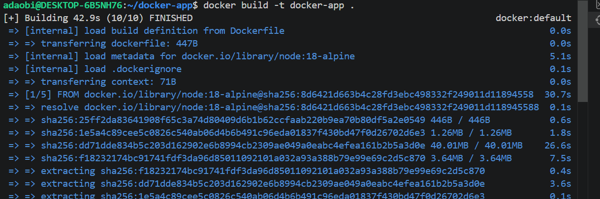
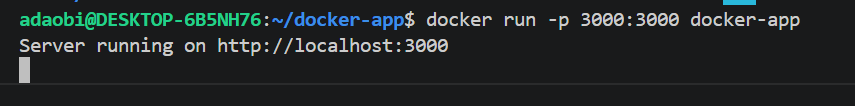
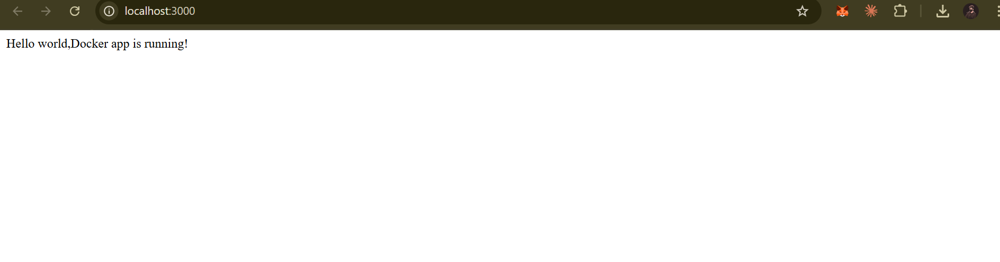
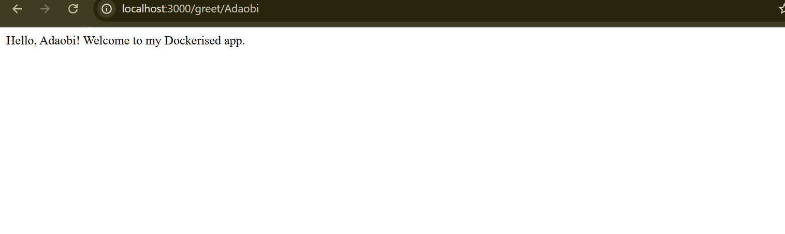

# Docker Take-Home Assignment

A simple Node.js/Express app with 2 REST endpoints, containerised with Docker.

## Endpoints

| Method | Path | Description |
|--------|------|-------------|
| GET | `/` |Returns Hello world,Docker app is running |
| GET | `/greet/:name` | Returns a personalised greeting |

## Prerequisites

- [Docker Desktop](https://www.docker.com/products/docker-desktop/)
- Node.js 18+ (optional, for local dev)

## Running with Docker

```bash
# 1. Clone the repo
git clone https://github.com/Adaobilynda1234/SCA-docker-app.git
cd docker-app

# 2. Build the image
docker build -t docker-app .

# 3. Run the container
docker run -p 3000:3000 docker-app
```

App will be available at http://localhost:3000

Second endpoint will be available at http://localhost:3000/greet/{name}

## 📁 Pipeline File Location

```
.github/workflows/docker.yml
```

---

## 🔍 docker.yml Explained

```yaml
name: CI/CD Pipeline
```

* Name of the workflow

```yaml
on:
  push:
    branches: [ "main" ]
```

* Triggers pipeline when code is pushed to main branch

```yaml
jobs:
  build-and-push:
    runs-on: ubuntu-latest
```

* Defines a job that runs on a Linux environment

---

### Step 1: Checkout Code

```yaml
- name: Checkout repository
  uses: actions/checkout@v3
```

* Pulls your code into the runner

---

### Step 2: Setup Docker

```yaml
- name: Set up Docker Buildx
  uses: docker/setup-buildx-action@v3
```

* Enables advanced Docker build features

---

### Step 3: Login to Docker Hub

```yaml
- name: Login to DockerHub
  uses: docker/login-action@v3
  with:
    username: ${{ secrets.DOCKER_USERNAME }}
    password: ${{ secrets.DOCKER_PASSWORD }}
```

* Logs into Docker Hub securely using secrets
* Prevents exposing credentials in code

---

### Step 4: Build and Push Image

```yaml
- name: Build and Push Docker Image
  uses: docker/build-push-action@v5
  with:
    context: .
    push: true
    tags: lyndadev/docker-app:latest
```

* Builds Docker image from current directory
* Pushes image to Docker Hub
* Tags image as `latest`

---

# 🔐 Adding Docker Secrets (IMPORTANT)

To allow GitHub Actions push to Docker Hub, you must add secrets:

## Step-by-Step

1. Go to your GitHub repository
2. Click **Settings**
3. Click **Secrets and variables → Actions**
4. Click **New repository secret**

---

## Add the following:

### 1. Docker Username

```
Name: DOCKER_USERNAME
Value: your docker username
```

---

### 2. Docker Password or Access Token

```
Name: DOCKER_PASSWORD
Value: your-docker-password-or-token
```

💡 Recommended:

* Use **Docker Hub Access Token** instead of password
* More secure

---

## 🔑 How to Create Docker Access Token

1. Go to Docker Hub
2. Click your profile → **Account Settings**
3. Click **Security**
4. Click **New Access Token**
5. Copy and use it as `DOCKER_PASSWORD`

---

# 🐳 Docker Hub Repository

👉 https://hub.docker.com/r/lyndadev/docker-app

---

## Pull and Run Image

```bash
docker pull lyndadev/docker-app:latest
docker run -p 3000:3000 lyndadev/docker-app
```

---

# 🛠️ Running Locally

```bash
git clone https://github.com/Adaobilynda1234/SCA-docker-app.git
cd docker-app

docker build -t docker-app .
docker run -p 3000:3000 docker-app
```

---

# 🌐 Application Endpoints

* http://localhost:3000
* http://localhost:3000/greet/Ada

---

# 📁 Project Structure

```
docker-app/
├── .github/
│   └── workflows/
│       └── docker.yml        # CI/CD pipeline configuration
├── screenshots/              # Evidence of running application
├── index.js                  # Express app
├── Dockerfile                # Docker configuration
├── .dockerignore             # Ignore unnecessary files in Docker build
├── .gitignore                # Ignore unnecessary files in Git
├── package.json
├── package-lock.json
└── README.md
```

---

# 📸 Screenshots

### Docker Build



### Docker Run



### Application Running



### Greeting Endpoint



### GitHub Actions Pipeline

(Add screenshot of successful pipeline)

### Docker Hub Repository

(Add screenshot of Docker Hub page)

---

# ✅ Summary

This project demonstrates:

* Node.js application development
* Docker containerisation
* CI/CD pipeline automation using GitHub Actions
* Secure credential management using GitHub Secrets
* Deployment to Docker Hub

---
